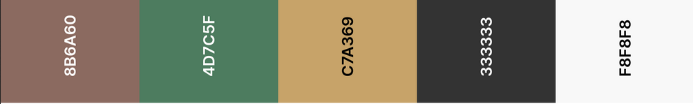
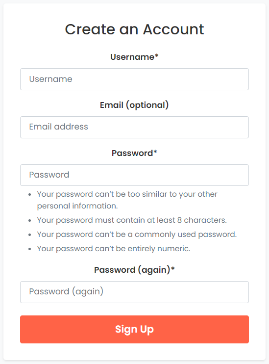

# Restaurant Booking System

## Table of Contents

- [User Experience](#user-experience)
- [Project Goals](#project-goals)
- [Agile Methodology](#agile-methodology)
- [Target Audience](#target-audience)
- [Design](#design)
  * [Color Scheme](#color-scheme)  
  * [Wireframes](#wireframes)
- [Data Model](#data-model)
  * [User Journey](#user-journey)
  * [Database Scheme](#database-scheme)
  * [ERD Diagram](#erd-diagram)
- [Security Features](#security-features)
- [Features](#features)
  * [Existing Features](#existing-features)
  * [Features Left to Implement](#features-left-to-implement)
- [Technologies Used](#technologies-used)
  * [Languages Used](#languages-used)
  * [Databases Used](#databases-used)
  * [Frameworks Used](#frameworks-used)
  * [Programs Used](#programs-used)
- [Deployment and Local Development](#deployment-and-local-development)
  * [Local Development](#local-development)
  * [ElephantSQL Database](#elephantsql-database)
  * [Cloudinary](#cloudinary)
  * [Heroku Deployment](#heroku-deployment)
- [Testing](#testing)
- [References](#references)
  * [Docs](#docs)
  * [Content](#content)
  * [Acknowledgments](#acknowledgments)

<small><i><a href='http://ecotrust-canada.github.io/markdown-toc/'>Table of contents generated with markdown-toc</a></i></small>

## User Experience
The primary goal of this project is to provide an exceptional user experience for both customers and restaurant staff. Customers will enjoy a seamless and intuitive process for booking reservations, viewing available tables, and managing their bookings. The system will be designed with a clean and modern interface, ensuring ease of use and accessibility across various devices.

On the other hand, restaurant staff will benefit from a comprehensive administrative interface that streamlines the management of bookings, tables, and customer information. The interface will be user-friendly and efficient, allowing staff to quickly access and update relevant data, ensuring smooth operations and excellent customer service.

## Project Goals
1. **Develop a user-friendly restaurant booking system**: Implement a web-based application that allows customers to easily book reservations, view available tables, and manage their bookings.

2. **Provide an administrative interface**: Create a secure and comprehensive administrative interface for restaurant staff to manage bookings, tables, customer information, and other relevant data.

3. **Ensure data integrity and security**: Implement robust data validation and security measures to protect customer information and ensure the integrity of the booking system.

4. **Enhance customer experience**: Incorporate features that enhance the customer experience, such as email confirmations, reminders, and the ability to leave reviews or feedback.

5. **Optimize for performance and scalability**: Develop the system with performance and scalability in mind, ensuring it can handle high traffic and grow with the restaurant's needs.

6. **Ensure responsiveness and accessibility**: Design the user interface to be responsive and accessible across various devices and platforms, ensuring a consistent and inclusive experience for all users.

## Agile Methodology
The project is being developed using an Agile methodology to help prioritize and organize tasks. This involves writing user stories and using Project Boards on GitHub.

## User Stories and Epics

A template is created to help write user stories in a consistent format: "As a [type of user], I want [goal] so that [benefit]." Epics are also written, containing possible user stories. Based on these epics, the website features are planned and implemented.

User stories are created by looking at the epics and refined through an iterative process as the project progresses. This allows me to stay focused on delivering value to users.

### Epics

### Home Page
- **Epic**: As a developer, I want to develop a user-friendly home page that provides navigation to different parts of the site and displays the restaurant's information.

  **Potential User Stories**:
  - As a developer, I want to design a visually appealing home page so that users find it engaging.
  - As a developer, I want to display the restaurant's information on the home page so that users can learn more about it.
  - As a developer, I want to provide easy navigation on the home page so that users can easily access different parts of the site.

### User Registration
- **Epic**: As a developer, I want to implement a user registration and login system that allows users to create and access their accounts.

  **Potential User Stories**:
  - As a developer, I want to create a registration form so that new users can create an account.
  - As a developer, I want to create a login form so that registered users can access their account.

### Website Admin and Bookings
- **Epic**: As a developer, I want to develop an administrative interface for managing bookings, tables, and customer information, and a user interface for making, viewing, updating, and canceling reservations.

  **Potential User Stories**:
  - As a developer, I want to create an admin interface so that restaurant staff can manage bookings, tables, and customer information.
  - As a developer, I want to create a user interface for reservations so that users can make, view, update, and cancel their reservations.

### Maintain consistent design with responsiveness in mind
- **Epic**: As a developer, I want to ensure that the website has a consistent design across different pages and is responsive to different screen sizes.

  **Potential User Stories**:
  - As a developer, I want to maintain a consistent design across the website so that it provides a seamless user experience.
  - As a developer, I want to make the website responsive so that it looks good on devices of all sizes.

### User Stories

#### User Registration and Login
- As a new user, I want to register so that I can make a reservation.
- As a registered user, I want to log in so that I can access my account.

#### Homepage
- As a user, I want to see a homepage that displays the restaurant’s information and allows me to navigate to different parts of the site.

#### Making a Reservation
- As a user, I want to select a date, time, and number of guests for my reservation so that I can book a table.
- As a user, I want to receive a confirmation after I make a reservation so that I know it was successful.

#### Viewing and Updating a Reservation
- As a user, I want to view my reservations so that I can keep track of them.
- As a user, I want to update my reservation (change the date, time, or number of guests) so that I can make changes if my plans change.

#### Canceling a Reservation
- As a user, I want to cancel my reservation so that the table can be freed up if I can’t make it.

#### Reviewing a Restaurant
- As a user, I want to write a review about my experience at the restaurant so that other users can read it.
- As a user, I want to read reviews from other users so that I can make an informed decision about whether to book a table.

### Project Board
The project board on GitHub is set to public, allowing for transparency and collaboration. It is used to track the progression of tasks through the "To Do", "In Progress", and "Done" columns.

Labels are added to the issues to sort them based on importance, such as "high priority", "medium priority", and "low priority". This helps me prioritize the most critical tasks.

## Target Audience
The restaurant booking system will cater to three main user groups:
- **First time user**: First-time users will be able to easily navigate the system to find available tables, view restaurant information, and make reservations. The system will provide clear instructions and intuitive interfaces to guide them through the booking process.
- **Registered user**: Registered users will have additional features, such as the ability to view their booking history, update their profile information, and receive notifications about upcoming reservations. They will also be able to leave reviews and ratings for the restaurant.
- **Admin user**: Admin users, typically restaurant staff, will have access to a comprehensive management interface. They will be able to view and manage all bookings, add or remove tables, update restaurant information, and generate reports. The admin interface will be designed to be user-friendly and efficient, allowing staff to quickly access and update information as needed.

## Design

### Color Scheme

The color scheme for the restaurant booking system aims to create a warm and inviting atmosphere. The primary colors are a combination of earthy tones, such as browns and greens, with accents of gold or copper to add a touch of elegance.

  - **Primary-color (#8b6a60)**: A warm brown shade used for primary elements like buttons and headings.

  - **Secondary-color (#4d7c5f)**: A natural green shade used for secondary elements like navigation and accents.

  - **Accent-color (#c7a369)**: A golden shade used for highlighting important elements and adding a touch of elegance.

  - **Text-color (#333333)**: A dark gray shade used for body text to ensure good readability.

  - **Background-color (#f8f8f8)**: A light gray shade used for the background to create a clean and modern look.

## Wireframes

Below are wireframe examples for different sections of the booking system:

1. **Homepage Wireframe:**
   - The homepage wireframe outlines the layout, navigation, and key elements of the landing page.

      
      

2. **Booking Page Wireframe:**
   - The booking page wireframe focuses on the user's reservation journey.

      
      

3. **Register Page Wireframe:**
   - The register page wireframe includes form fields for user registration.

      
      

4. **Reservations Page Wireframe:**
   - The reservations page wireframe displays booked reservations and relevant details.

      
      

## Data Model

### User Journey
The user journey will be carefully mapped out to ensure a seamless and intuitive experience for all users. This will include the steps involved in making a reservation, updating a booking, and accessing the admin dashboard.

### Database Scheme
The database scheme will be designed using PostgreSQL, a powerful and reliable open-source database management system. The scheme will include tables for users, bookings, tables, and restaurant details, with appropriate relationships and constraints to ensure data integrity and consistency.

#### Entity Relationship Diagram (ERD)

### Models
I've introduced new models to represent key entities in the system:

- **Restaurant**: Represents a restaurant with attributes such as name, location, cuisine, etc.
- **Table**: Represents a table in a restaurant with attributes like capacity and table number.
- **Reservation**: Represents a reservation made by a user for a specific table on a given date and time.
- **Review**: Represents a review left by a user for a restaurant, including a rating and comments.

These models are designed to capture essential data and facilitate smooth interaction within the application.

## Security Features
The restaurant booking system will incorporate robust security features to protect user data and prevent unauthorized access. This will include:
- Password hashing and salting to securely store user passwords
- CSRF protection to prevent cross-site request forgery attacks
- SSL/TLS encryption to secure communication between the client and server
- Rate limiting to prevent brute-force attacks and denial-of-service attacks

## Features

### Existing Features

#### Homepage
- This is the first page users see. It displays the restaurant booking system app's name, a brief description, and navigation links to:
  - 'Book a Table'
  - 'View Reservations'
  - 'Login/Register'
  - 'Reviews'

#### Login Page
- This page has a form for users to log in. The form has the necessary fields (like username, password, etc.).

#### Register Page
- This page has a form for users to register. The form has the necessary fields (like username, password, etc.).

### Features Partially Implemented

#### Booking Page
- This page allows users to book a table.
- It currently has a form where users can select the date, time, and number of guests for their reservation.
- Additional functionality to handle form submissions and confirm bookings is in progress.

#### Reservations Page
- This page displays a list of the user's current reservations.
- Basic display of reservations is implemented.
- Options to 'Edit' or 'Cancel' reservations are in progress.

#### Review Page
- This page allows users to write a review and displays reviews from other users.
- The form for writing reviews is implemented.
- Displaying reviews in a list or grid layout is in progress.

### Features Left to Implement

#### Admin Dashboard
- Managing all bookings, tables, and user accounts.
- Advanced reporting and analytics features.

#### Advanced Booking Management
- Adding features like special requests, booking confirmation emails, and integration with calendar apps.

## Technologies Used
### Languages Used
- Python
- HTML
- CSS
- JavaScript

### Databases Used
- PostgreSQL

### Frameworks Used
- Django
- Bootstrap

### Programs Used
- Git
- GitHub
- Heroku
- Cloudinary
- ElephantSQL

## Deployment and Local Development

### Local Development
To set up the project for local development, follow these steps:
1. Clone the repository to your local machine
2. Create a virtual environment and activate it
3. Install the required dependencies using `pip install -r requirements.txt`
4. Set up environment variables for database connection and other sensitive information
5. Run the Django development server using `python manage.py runserver`

### ElephantSQL Database
The project will use ElephantSQL, a cloud-based PostgreSQL database service, for storing all application data. ElephantSQL provides a simple and reliable way to manage and scale PostgreSQL databases.

### Cloudinary
Cloudinary, a cloud-based image and video management service, will be used for storing and serving the restaurant's cabin images. Cloudinary offers easy integration with Django and provides features such as automatic image optimization and responsive delivery.

### Heroku Deployment
The restaurant booking system will be deployed to Heroku, a cloud platform that enables developers to build, run, and operate applications entirely in the cloud. Heroku provides a simple and efficient way to deploy Django applications and manage their infrastructure.

## Testing
Comprehensive testing will be conducted throughout the development process to ensure the quality and reliability of the restaurant booking system. This will include:
- Unit tests for individual components and functions
- Integration tests to verify the interaction between different modules
- End-to-end tests to simulate real-world user scenarios
- Usability testing with actual users to identify and address any issues with the user interface or user experience

## References
### Docs
- [Django Documentation](https://docs.djangoproject.com/)
- [Bootstrap Documentation](https://getbootstrap.com/docs/)
- [PostgreSQL Documentation](https://www.postgresql.org/docs/)

### Content
- [ElephantSQL Documentation](https://www.elephantsql.com/docs/index.html)
- [Cloudinary Documentation](https://cloudinary.com/documentation)

### Acknowledgments
I would like to acknowledge the following resources and individuals who have contributed to the development of this project:
- The Django community for their excellent documentation and support
- The Bootstrap community for providing a powerful and flexible CSS framework
- The PostgreSQL community for developing a robust and reliable database management system
- The ElephantSQL, Cloudinary, and Heroku teams for their cloud-based services and support
- My mentor Mitko Bachvarov for his support and feedback throughout the project developemnt process
