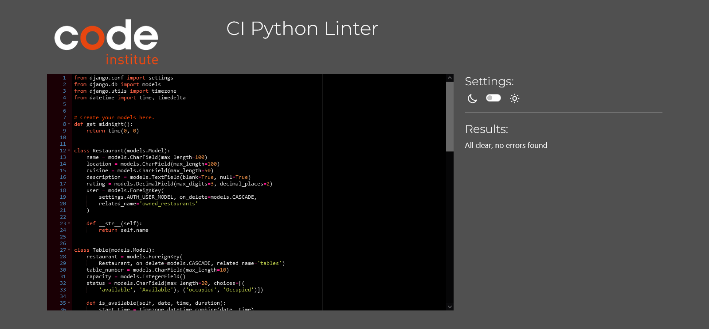

# BookDine Application Documentation


Welcome to Book & Dine, your online restaurant reservation platform. This app allows users to discover, book tables, and review restaurants for a seamless dining experience.

Some features on the site are available exclusively to registered users, including viewing your reservation history, saving favorite restaurants, and adding restaurant reviews.

Users can search for restaurants, view restaurant details, make reservations, and manage their bookings. There is also a feedback page, a privacy policy, and a section on cancellation and modification of reservations.

[Live link to Book & Dine](https://book-dine-c8d9fe1355da.herokuapp.com/)

<br>

## Table of Contents

- [BookDine Application Documentation](#bookdine-application-documentation)
  - [Table of Contents](#table-of-contents)
  - [User Experience](#user-experience)
  - [Project Goals](#project-goals)
  - [Agile Methodology](#agile-methodology)
    - [Prioritization and Classification](#prioritization-and-classification)
    - [Focus Areas](#focus-areas)
  - [User Stories](#user-stories)
  - [Design](#design)
    - [Color Scheme](#color-scheme)
    - [Wireframes](#wireframes)
  - [Data Model](#data-model)
    - [User Journey](#user-journey)
    - [Database Scheme](#database-scheme)
    - [Models](#models)
      - [User Model](#user-model)
      - [Booking Model](#booking-model)
      - [Table Model](#table-model)
      - [Review Model](#review-model)
    - [ERD Diagram](#erd-diagram)
      - [Entity Relationship Diagram (ERD)](#entity-relationship-diagram--erd-)
  - [Security Features](#security-features)
  - [Features](#features)
    - [Existing Features](#existing-features)
  - [Screenshots](#screenshots)
    - [1. User Registration and Login](#1-user-registration-and-login)
    - [2. Booking System](#2-booking-system)
    - [3. Admin Interface](#3-admin-interface)
    - [4. Email Notifications](#4-email-notifications)
    - [5. Review System](#5-review-system)
    - [6. Booking Modification and Cancellation](#6-booking-modification-and-cancellation)
    - [7. Responsive Design](#7-responsive-design)
    - [8. Advanced Search and Filter](#8-advanced-search-and-filter)
  - [Technologies Used](#technologies-used)
    - [Languages Used](#languages-used)
    - [Databases Used](#databases-used)
    - [Frameworks Used](#frameworks-used)
    - [Tools And Resources Used](#tools-and-resources-used)
  - [Deployment and Local Development](#deployment-and-local-development)
    - [Local Development](#local-development)
    - [Neon PostgreSQL Database](#Neon PostgreSQL-database)
    - [Cloudinary](#cloudinary)
    - [Heroku Deployment](#heroku-deployment)
  - [Testing](#testing)
  - [Code Validation](#code-validation)
    - [HTML](#html)
    - [CSS](#css)
    - [Python](#python)
  - [Manual Testing](#manual-testing)
  - [Automated Testing](#automated-testing)
    - [Python (Unit Testing)](#python--unit-testing-)
    - [Error Pages](#error-pages)
  - [References](#references)
    - [Docs](#docs)
    - [Content](#content)
    - [Acknowledgments](#acknowledgments)

<small><i><a href='http://ecotrust-canada.github.io/markdown-toc/'>Table of contents generated with markdown-toc</a></i></small>

## User Experience

The primary goal of the Book Dine project is to provide an exceptional user experience for both customers and restaurant staff. Customers will enjoy a seamless and intuitive process for booking reservations, viewing available tables, and managing their bookings. The system is designed with a clean and modern interface, ensuring ease of use and accessibility across various devices.

Restaurant staff will benefit from a comprehensive administrative interface that streamlines the management of bookings, tables, and customer information. This interface is user-friendly and efficient, allowing staff to quickly access and update relevant data, ensuring smooth operations and excellent customer service.

## Project Goals

1. **Develop a user-friendly restaurant booking system**: Implement a web-based application that allows customers to easily book reservations, view available tables, and manage their bookings.

2. **Provide an administrative interface**: Create a secure and comprehensive administrative interface for restaurant staff to manage bookings, tables, customer information, and other relevant data.

3. **Ensure data integrity and security**: Implement robust data validation and security measures to protect customer information and ensure the integrity of the booking system.

4. **Enhance customer experience**: Incorporate features that enhance the customer experience, such as email confirmations, reminders, and the ability to leave reviews or feedback.

5. **Optimize for performance and scalability**: Develop the system with performance and scalability in mind, ensuring it can handle high traffic and grow with the restaurant's needs.

6. **Ensure responsiveness and accessibility**: Design the user interface to be responsive and accessible across various devices and platforms, ensuring a consistent and inclusive experience for all users.

## Strategy

### Targeted Users

- Users looking to easily book a table at their favorite restaurants.
- Restaurant patrons seeking to manage their reservations and receive booking confirmations.
- Restaurant staff needing to manage customer reservations and tables efficiently.

### Site Goals

- Enable users to swiftly and effortlessly book tables at restaurants.
- Facilitate an easy process for managing bookings and reservations.
- Provide restaurant staff with the ability to manage customer information, bookings, and tables through a secure and efficient administrative interface.
- Ensure a responsive and accessible interface for users across all devices.

[Back to Top](#table-of-contents)

<br>

## Agile Methodology

The project is developed using Agile methodology to effectively prioritize and organize tasks. This involves creating user stories and utilizing Project Boards on GitHub.

### Prioritization and Classification

To prioritize development efforts, features were classified into the following categories:

- **Must Have**: Essential features required for the core functionality.
- **Should Have**: Important features that enhance the product but are not critical for the initial release.
- **Could Have**: Features that are nice to have but not necessary.
- **Won't Have**: Features that are not included in the current iteration.

This classification facilitated the determination of feature importance and helped in managing development priorities effectively.

### Focus Areas

The product section was given the highest priority, receiving the most attention and resources to ensure its completion and quality.

For more details on the project's progress and planning, visit the [Project Board](https://github.com/users/yosephdev/projects/6/views/1).


[Back to Top](#table-of-contents)

<br>

## User Stories

Based on the collected user stories, a project implementation plan was developed. You can review the user stories [here](https://github.com/yosephdev/book-dine/issues?q=is%3Aissue+is%3Aclosed).


Each user story was assigned a point value reflecting its implementation complexity. The MoSCoW principle (Must Have, Should Have, Could Have, Won't Have) was used to plan iterations and prioritize tasks.

Milestones for the project can be reviewed [here](https://github.com/CodeWizard-1/e-commerce/milestones?state=closed).


<br>

[Back to Top](#table-of-contents)

<br>

## Design

### Color Scheme

The color scheme for the restaurant booking system has been updated to be bold and modern, utilizing vibrant colors to capture attention and create a lively atmosphere.

```css
/* Color variables */
:root {
  --primary-color: #ff5733; /* Spicy Red */
  --secondary-color: #ffc300; /* Bright Yellow */
  --accent-color: #c70039; /* Deep Pink */
  --danger-color: #dc3545; /* Bootstrap danger color */
  --text-color: #333333; /* Dark gray */
  --background-color: #ffffff; /* White */
  --background-hover: #f1f1f1; /* Light hover */
}
```

### Wireframes

Below are wireframe examples for different sections of the booking system:

<details>
<summary>Click to view wireframes</summary>

1. **Homepage Wireframe:**

   - The homepage will display the restaurant's information, navigation links, and a section for booking reservations.
   - It will have a clean and modern layout with easy access to other parts of the site.

     
     

2. **User Registration and Login Wireframe:**

   - The registration form will include fields for the user's name, email, password, and contact information.
   - The login form will have fields for the email and password, with a link to reset the password if needed.

     
     

3. **Booking Interface Wireframe:**

   - The booking interface will allow users to select a date, time, and number of guests for their reservation.
   - It will display available tables and provide options to confirm or modify the booking.

     
     

4. **Admin Interface Wireframe:**

   - The admin interface will provide tools for managing bookings, tables, customer information, and generating reports.
   - It will have a dashboard with an overview of the current bookings and quick access to key functionalities.

     
     

</details>

<br>

[Back to Top](#table-of-contents)

<br>

## Data Model

### User Journey

The user journey includes the following key steps:

1. **Registration**: New users can create an account by providing their details.
2. **Login**: Registered users can log in to access their account and make reservations.
3. **Booking**: Users can select a date, time, and number of guests to book a table.
4. **Confirmation**: After booking, users receive a confirmation email with the reservation details.
5. **Modification**: Users can view and update their reservations if needed.
6. **Cancellation**: Users can cancel their reservations, freeing up the table for others.

<br>

[Back to Top](#table-of-contents)

### Database Scheme

The database scheme will include tables for users, bookings, tables, and reviews:

- **Users**: Stores user information such as name, email, password, and contact details.
- **Bookings**: Stores booking details including user ID, table ID, date, time, and number of guests.
- **Tables**: Stores information about the restaurant's tables including table number, capacity, and availability status.
- **Reviews**: Stores user reviews and ratings for the restaurant.

<br>

[Back to Top](#table-of-contents)

### Models

#### User Model

- **Fields**: id, name, email, password, contact
- **Relationships**: One-to-Many relationship with bookings and reviews

#### Booking Model

- **Fields**: id, user_id, table_id, date, time, number_of_guests
- **Relationships**: Many-to-One relationship with users and tables

#### Table Model

- **Fields**: id, table_number, capacity, availability_status
- **Relationships**: One-to-Many relationship with bookings

#### Review Model

- **Fields**: id, user_id, rating, comment, date
- **Relationships**: Many-to-One relationship with users

### ERD Diagram

An ERD diagram will visually represent the relationships between the different tables in the database.

#### Entity Relationship Diagram (ERD)


<br>

[Back to Top](#table-of-contents)

## Security Features

The booking system will include the following security features:

- **Data Encryption**: All sensitive data, such as passwords, will be encrypted using strong encryption algorithms.
- **Input Validation**: All user inputs will be validated to prevent SQL injection and other common attacks.
- **Access Control**: User roles and permissions will be implemented to ensure that only authorized users can access certain features and data.
- **Secure Communication**: All communication between the client and server will be encrypted using HTTPS.

## Features

### Existing Features

1. **User Registration and Login**: Users can create an account and log in to access their profile and booking features.
2. **Booking System**: Users can book a table by selecting the date, time, and number of guests.
3. **Admin Interface**: Restaurant staff can manage bookings, tables, and customer information through a secure admin interface.
4. **Email Notifications**: Users receive email confirmations and reminders for their bookings.
5. **Review System**: Users can leave reviews and ratings for the restaurant.
6. **Booking Modification and Cancellation**: Users can view, update, and cancel their reservations.
7. **Responsive Design**: The website is fully responsive and accessible on all devices.
8. **Advanced Search and Filter**: Users can find available tables based on various criteria.

<br>

[Back to Top](#table-of-contents)

## Screenshots

<details>
<summary>Click to view screenshots</summary>

### 1. User Registration and Login

- **User Registration**: 
- **User Login**: 

### 2. Booking System

- **Booking Page**: 

### 3. Admin Interface

- **Admin Login**: 
- **Admin Dashboard**: 

### 4. Email Notifications

- **Email Confirmation**: 
- **Email Reminder**: 

### 5. Review System

- **Leave a Review**: 

### 6. Booking Modification and Cancellation

- **View Reservations**: 
- **Modify Reservation**: 
- **Cancel Reservation**: 

### 7. Responsive Design

- **Responsive Home Page (Mobile)**: 
- **Responsive Booking Page (Tablet)**: 

### 8. Advanced Search and Filter

- **Search Page**: 

</details>

<br>

[Back to Top](#table-of-contents)

<br>

## Technologies Used

### Languages Used

- [HTML5](https://en.wikipedia.org/wiki/HTML5)
- [CSS3](https://en.wikipedia.org/wiki/Cascading_Style_Sheets)
- [Javascript](https://en.wikipedia.org/wiki/JavaScript)
- [Python](<https://en.wikipedia.org/wiki/Python_(programming_language)>)

### Databases Used

- [Neon PostgreSQL](https://neon.tech/)

### Frameworks Used

- [Django](https://www.djangoproject.com/)
- [Bootstrap](https://blog.getbootstrap.com/)

### Tools And Resources Used

- [GitPod](https://www.gitpod.io/)
- [GitHub](https://github.com/)
- [Heroku](https://heroku.com)
- [Neon PostgreSQL](https://neon.tech/)
- [Cloudinary](https://cloudinary.com/)
- [Coolors](https://coolors.co/)
- [AmIResponsive](https://ui.dev/amiresponsive)

## Deployment and Local Development

### Local Development

To run the project locally:

1. Clone the repository: `git clone <repository-url>`
2. Create a virtual environment: `python -m venv venv`
3. Activate the virtual environment:
   - On Windows: `venv\Scripts\activate`
   - On macOS/Linux: `source venv/bin/activate`
4. Install the dependencies: `pip install -r requirements.txt`
5. Set up the database: `python manage.py migrate`
6. Create a superuser for the admin interface: `python manage.py createsuperuser`
7. Run the development server: `python manage.py runserver`

### Neon PostgreSQL Database

To set up the Neon PostgreSQL database:

1. Create an account on Neon PostgreSQL and create a new PostgreSQL instance.
2. Copy the database URL provided by Neon PostgreSQL.
3. Update the Django settings file to use the Neon PostgreSQL database URL.

### Cloudinary

To set up Cloudinary for image storage:

1. Create an account on Cloudinary and get the API credentials.
2. Update the Django settings file with the Cloudinary API credentials.

### Heroku Deployment

To deploy the project to Heroku:

1. Create a Heroku account and install the Heroku CLI.
2. Log in to Heroku: `heroku login`
3. Create a new Heroku app: `heroku create <app-name>`
4. Set up the Heroku PostgreSQL add-on: `heroku addons:create heroku-postgresql:hobby-dev`
5. Push the code to Heroku: `git push heroku main`
6. Set up the necessary environment variables in Heroku.

<br>

[Back to Top](#table-of-contents)

<br>

## Testing

During the development of this project, I conducted various tests to ensure the proper functioning of the website. In this section, you will find documentation on all tests performed on the site.

## Code Validation

I tested all my code using each language's preferred programming tools.

### HTML

I have used the recommended [HTML W3C Validator](https://validator.w3.org) to validate all of my HTML files.

| File             | W3C Validation URL                                                                                                                            | Screenshot                                        | Notes           |
| ---------------- | --------------------------------------------------------------------------------------------------------------------------------------------- | ------------------------------------------------- | --------------- |
| index.html       | [Link](https://validator.w3.org/nu/?doc=https%3A%2F%2Fbook-dine-c8d9fe1355da.herokuapp.com%2F)                                                |  | Pass: No Errors |
| reservation.html | [Link](https://validator.w3.org/nu/?doc=https%3A%2F%2Fbook-dine-c8d9fe1355da.herokuapp.com%2Faccounts%2Flogin%2F%3Fnext%3D%2Freservations%2F) |  | Pass: No Errors |
| book_table.html  | [Link](https://validator.w3.org/nu/?doc=https%3A%2F%2Fbook-dine-c8d9fe1355da.herokuapp.com%2Fbook-table%2F)                                   |  | Pass: No Errors |

### CSS

I have used the recommended [CSS Jigsaw Validator](https://jigsaw.w3.org/css-validator) to validate all of my CSS files.

| File      | Jigsaw URL                                  | Screenshot                                      | Notes           |
| --------- | ------------------------------------------- | ----------------------------------------------- | --------------- |
| style.css | [Link](https://jigsaw.w3.org/css-validator) |  | Pass: No Errors |

### Python

I have used the recommended [CI Python Linter](https://pep8ci.herokuapp.com) to validate all of my Python files for BookDine.

| File      | CI Linter URL                        | Screenshot                                          | Notes           |
| --------- | ------------------------------------ | --------------------------------------------------- | --------------- |
| views.py  | [Link](https://pep8ci.herokuapp.com) |  | Pass: No Errors |
| models.py | [Link](https://pep8ci.herokuapp.com) |  | Pass: No Errors |
| urls.py   | [Link](https://pep8ci.herokuapp.com) |  | Pass: No Errors |

## Manual Testing

Below are the results of manual testing for the Book Dine app:

| Page                                    | User Action                                                                                        | Expected Result                                                                                      | Pass/Fail | Comments |
| --------------------------------------- | -------------------------------------------------------------------------------------------------- | ---------------------------------------------------------------------------------------------------- | --------- | -------- |
| **Home Page**                           |                                                                                                    |                                                                                                      |           |          |
|                                         | Click on Logo                                                                                      | Redirection to Home page                                                                             | Pass      |          |
|                                         | Click on a restaurant card                                                                         | Redirection to Restaurant Detail page                                                                | Pass      |          |
|                                         | Click on the "Sign Up" button                                                                      | Redirection to Sign Up page                                                                          | Pass      |          |
|                                         | Click on the "Sign In" button                                                                      | Redirection to Sign In page                                                                          | Pass      |          |
| **User Registration and Login**         |                                                                                                    |                                                                                                      |           |          |
|                                         | Navigate to the registration page.                                                                 | Redirection to Registration page                                                                     | Pass      |          |
|                                         | Fill in the registration form with valid details and submit.                                       | User is registered, and a confirmation message is displayed. User is redirected to the login page.   | Pass      |          |
|                                         | Navigate to the login page.                                                                        | Redirection to Login page                                                                            | Pass      |          |
|                                         | Enter valid login credentials and submit.                                                          | User is logged in, and the dashboard is displayed.                                                   | Pass      |          |
| **Booking a Reservation**               |                                                                                                    |                                                                                                      |           |          |
|                                         | Navigate to the booking page.                                                                      | Redirection to Booking page                                                                          | Pass      |          |
|                                         | Select a date, time, and number of guests, and submit the form.                                    | Reservation is created, and a confirmation message with reservation details is displayed.            | Pass      |          |
|                                         | Log in as a user and navigate to the reservations page.                                            | The list of reservations is displayed correctly with details.                                        | Pass      |          |
| **Updating and Canceling Reservations** |                                                                                                    |                                                                                                      |           |          |
|                                         | Navigate to the reservations page, select a reservation to update, modify the details, and submit. | Reservation is updated, and a confirmation message with updated details is displayed.                | Pass      |          |
|                                         | Navigate to the reservations page, select a reservation to cancel, and confirm cancellation.       | Reservation is removed, and a confirmation message is displayed.                                     | Pass      |          |
| **Reviewing a Restaurant**              |                                                                                                    |                                                                                                      |           |          |
|                                         | Navigate to a restaurant's detail page, fill in the review form, and submit it.                    | Review is submitted and displayed on the restaurant's detail page.                                   | Pass      |          |
|                                         | Navigate to a restaurant's detail page.                                                            | The list of reviews is displayed correctly with details such as reviewer name, rating, and comments. | Pass      |          |

<br>

## Automated Testing

Automatic testing results are below.

### Python (Unit Testing)

I have used Django's built-in unit testing framework to test the application functionality.

In order to run the tests, I ran the following command in the terminal each time:

`python3 manage.py test`


`python-m coverage report`


### Error Pages

1. **400 Bad Request**:

   - Trigger a 400 error (e.g., by sending a malformed request).
   - Verify that the custom 400 error page is displayed.

2. **500 Internal Server Error**:
   - Trigger a 500 error (e.g., by causing an exception in the code).
   - Verify that the custom 500 error page is displayed.

<br>

[Back to Top](#table-of-contents)

<br>

## References

### Docs

- [Django Documentation](https://docs.djangoproject.com/en/stable/)
- [Bootstrap Documentation](https://getbootstrap.com/docs/5.0/getting-started/introduction/)
- [PostgreSQL Documentation](https://www.postgresql.org/docs/)

### Acknowledgments

I would like to acknowledge the following individuals who have contributed to the development of this project:

- [Niel McEwen](https://github.com/NielMc)
- [Matt Rudge](https://github.com/lechien73)
- [Mitko Bachvarov](https://www.linkedin.com/in/mitko-bachvarov-40b50776/)
